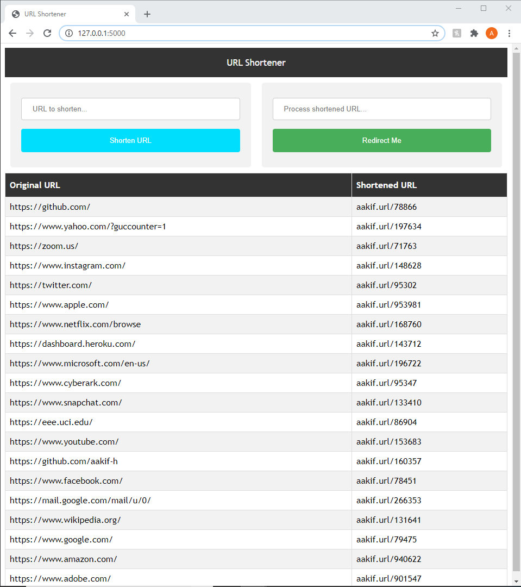

# URL Shortener

## Introduction
This project is my attempt at creating a service similar to TinyURL or Bit.ly. A user
should be able to enter in a URL, and my service will shorten that URL and store it in
a table. I worked on implementation for about 4 hours, and implemented the key
features of a shortening service.  

## How to Run
In order to run this web application, you need to have Python 2.7 installed. After 
completing this prerequisite, follow these steps:  
1. Navigate to the project directory
1. Run `pip install -r requirements.txt`
2. Run `python __init__.py` (or `python2 __init__.py` depending on the environment variable that maps to your Python2)
3. Open localhost (http://127.0.0.1:5000/) on your browser, and use the application!

## Implementation
I used SQLAlchemy as an ORM to store instances of URLs and their shortened versions. I implemented two key routes for the application:  
1. '/addURL': Adds the provided URL and shortened form to the ORM.
2. 'readShortenedURL': Converts the shortened URL back to its original form, and 
automatically redirects the user.

To convert the URL to its shortened form, I used hexadecimal encoding. I first 
converted the URL into its hexadecimal form, and then I split the hex string and
summed up the parts. The output is a number at most 6 digits long (for all practical 
purposes).

If the user wants to navigate to a shortened URL, they would use the application to
directly process it. The application will compare the given shortened URL with the 
object store, and automatically redirect the user if a matching URL is found.

## What's Next?
* The application should be hosted online, using some service like Heroku.  
* The redirecting service should also be hosted, so that users wouldn't have to 
load the web application to process their shortened URLs.
* Currently URLs are stored globally; that is, users have access to all processed URLs
in the database. To avoid privacy issues, this can be amended by taking advantage of
each user's LocalStorage.

## Preview

